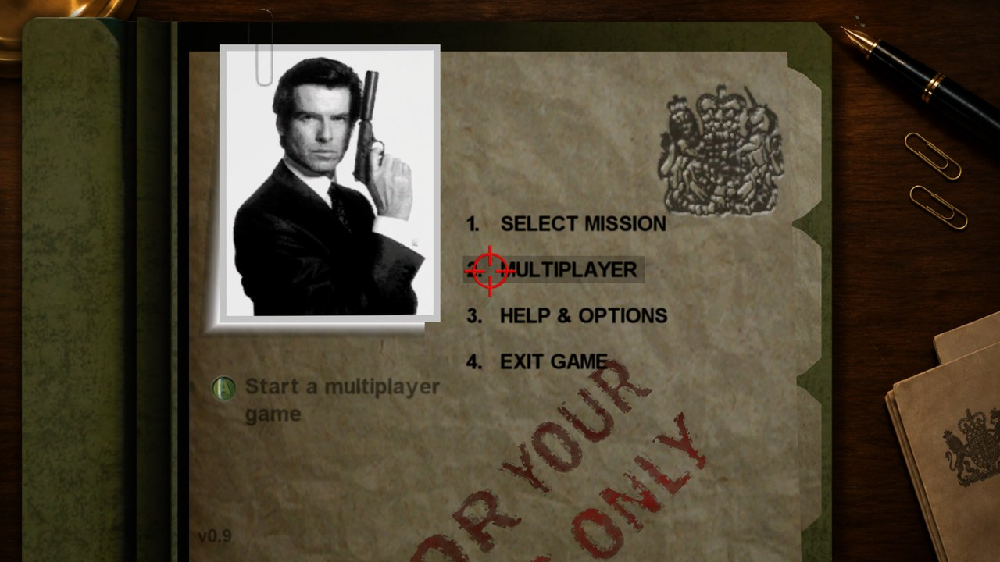
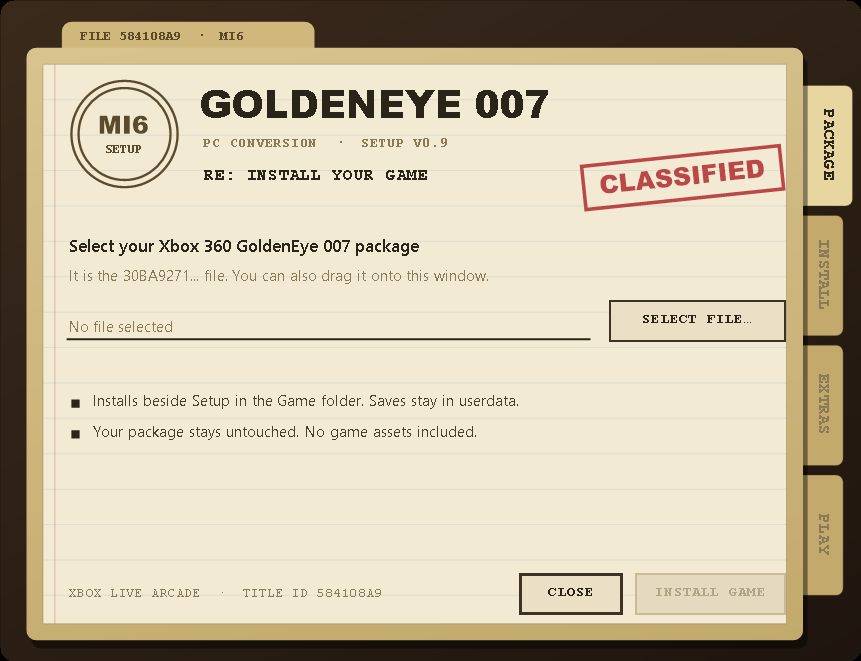
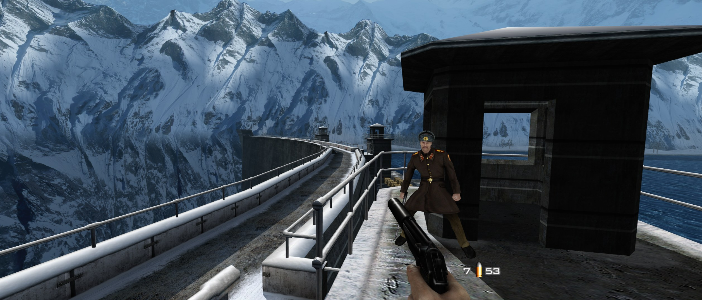
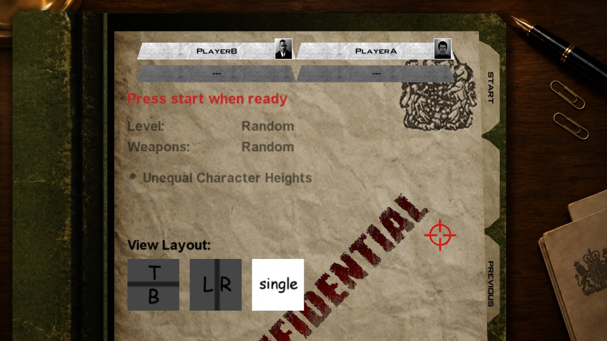
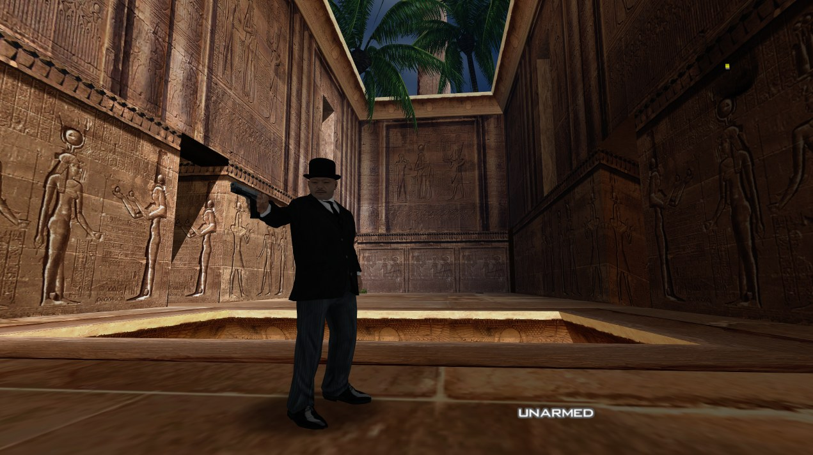

# GoldenEye 007 XBLA PC Recomp

A native Windows PC version of **GoldenEye 007**, based on the unreleased
Xbox 360/XBLA remaster, created through static recompilation with
[ReXGlue](https://github.com/rexglue/rexglue-sdk). It runs at up to 4K with
16:9 and 21:9 widescreen, 60 FPS by default with a higher frame limit
available, and switches between the original and enhanced graphics at the
press of a key. Keyboard and mouse, Xbox controllers and LAN multiplayer
(including online play through virtual LAN services) are all supported.

> **You need your own copy of GoldenEye 007 XBLA.** This project contains no
> original game executable, graphics, sound, music or other game data. Setup
> reads the Xbox 360 GoldenEye 007 package you provide, checks that it is the
> supported version and builds the game folder from it on your PC.

If you enjoy the GoldenEye 007 XBLA PC Recomp and would like to support future
projects, you can tip me on [Ko-fi](https://ko-fi.com/caiuscodes).
All support is optional and all releases remain free.

[](https://ko-fi.com/caiuscodes)



## Requirements

- Windows 10 or 11, 64-bit
- A graphics card with DirectX 12 support
- Your own GoldenEye 007 Xbox Live Arcade package (the Xbox 360 game file for
  Title ID `584108A9`)

Nothing else needs installing; the Visual C++ runtime is included. An Xbox
controller is optional.

## Install and play

1. Download the release ZIP from the
   [Releases](https://github.com/CaiusCodes/GoldenEye-007-XBLA-PC-Recomp/releases)
   page and extract it to a writable folder (not Program Files).
2. Run **Setup GoldenEye 007.exe**.
3. Choose your GoldenEye 007 package with **Select file...**, or drag it onto
   the Setup window. Setup tells you straight away if it is the wrong file or
   an unsupported version.
4. Choose **Install game**, pick any optional extras (start in fullscreen,
   100% game completion, desktop shortcut), then **Play now**.



Afterwards, start the game with `Game\GoldenEye 007.exe`. Saves and settings
stay inside the extracted folder, so it can be moved or backed up as a whole.
Run Setup again at any time to reinstall or change the extras; your saves and
settings are kept.

Setup only reads your package and never changes it. It downloads nothing, and
neither Setup nor the game contacts Xbox Live.

## Features

- **Native Windows PC build**: no emulator, runs as a normal Windows program
- **Up to 4K**: windowed sizes from 1024×768 to 3840×2160, or fullscreen at
  your screen's resolution, rendered at twice the original resolution
- **Widescreen**: 16:9 and 21:9 (Screen Ratio in the game's options), with a
  desk backdrop around the menus on wide screens
  
- **60 FPS by default**, with V-Sync and a frame limit of 30 to 240 FPS or
  uncapped
- **Original and enhanced graphics**: switch between the two at any time (F,
  or RB on a controller)
- **Keyboard and mouse**: mouse look, rebindable keys, mouse sensitivity,
  separate precise-aim sensitivity, invert look, mouse wheel zoom on the
  sniper rifle, and the mouse in the menus and the pause watch
- **Xbox controller** support, working alongside keyboard and mouse
- **LAN multiplayer** (Multiplayer → LAN or Virtual LAN), and **online
  multiplayer** through virtual LAN services such as Radmin VPN, ZeroTier,
  Tailscale and Hamachi
  
  
- **Settings menu** (Help & Options): Keyboard & Mouse, Video Settings
  (display mode, window size, V-Sync, frame limit, field of view,
  anti-aliasing, texture filtering, post-processing filter) and Online
  Settings
- **Wider field of view** (10 degrees wider by default, adjustable from the
  original up to +30)
- Optional **100% game completion** in Setup: every mission, difficulty,
  007 mode and cheat unlocked
- **Portable**: saves and settings stay in the game folder
- **GoldenEye fixes and improvements** carried over from the GoldenEye Recomp
  community: level and setup bug fixes from the BeanTools Community Edition,
  watch and mission music fixes, tank mouse aiming, Frigate water, extra
  multiplayer characters, guards' bodies that stay for 60 seconds, and a
  main menu without the Xbox LIVE-only entries

### Controls

| Key / button | Action |
|---|---|
| W, A, S, D | Move |
| Mouse | Look and aim; moves the crosshair in menus |
| Left click | Fire |
| Right click | Aim and precise aim; back in menus |
| E | Activate (A button); select in menus |
| Q | Cycle gadgets |
| R | Reload |
| Mouse wheel | Cycle weapons; zoom while aiming the sniper rifle |
| F | Toggle graphics (original / enhanced) |
| Ctrl | Crouch |
| Escape, Enter | Start: pause with the watch menu; Escape is back in menus |
| Tab | Objectives / scores |
| Arrow keys | D-pad |

Keys can be changed in Help & Options → Keyboard & Mouse, or on the watch's
Keyboard Controls page during a mission. An Xbox controller works as on the
console.

## Known limitations

- Windows only for now.
- Only the GoldenEye 007 Xbox Live Arcade package with Title ID `584108A9`
  and the exact game program this port was recompiled from is supported;
  Setup refuses other builds.
- This is a development preview: not every mission has been played through
  with this build yet.
- Local split-screen multiplayer (several controllers on one PC) has not been
  tested yet.
- Xbox LIVE features are not available: multiplayer works through LAN or a
  virtual LAN. Online Settings' server play needs a GoldenEye Recomp online
  server, which this project does not provide.
- Setup and the game are not digitally signed, so Windows SmartScreen may warn
  the first time; choose *More info* → *Run anyway*. Windows also asks for
  network access the first time you host or join a LAN game.

If something goes wrong, include the newest files from `Game\logs` when
reporting it.

## For Developers

Building from source. You need Git, CMake 3.25 or newer, Ninja, LLVM/Clang 18
or newer (installed in `C:\Program Files\LLVM`), Python 3, Visual Studio 2022
or newer with the C++ workload (Windows SDK and the Visual C++ runtime that
releases ship) and Windows PowerShell, plus your own GoldenEye 007 package.

ReXGlue is the `rexglue-sdk` submodule, pinned to upstream v0.10.0. This
project's changes to it, including the GoldenEye Recomp ReXGlue fork, are kept
in `patches/rexglue.patch`, which CMake applies automatically. ReXGlue's
dependencies are nested deeply, so enable long paths when cloning:

```powershell
git -c core.longpaths=true clone --recurse-submodules --shallow-submodules https://github.com/CaiusCodes/GoldenEye-007-XBLA-PC-Recomp.git
```

Extract your package into `game/`, generate the recompiled code from your own
`default.xex`, then build the game:

```powershell
.\packaging\resources\installer\Extract-STFS.ps1 -Path <your package> -OutputDir game
cmake --preset win-amd64-release
cmake --build --preset win-amd64-release --target ge_codegen
cmake --preset win-amd64-release
cmake --build --preset win-amd64-release
```

The `ge_codegen` step builds ReXGlue's code generator and translates
`game/default.xex` into C++ in `generated/`; the second configure picks that
code up. Later builds rerun the generator by themselves when its inputs
change. The generated code is derived from the game, so it is never committed
(only the SDK boilerplate `generated/rexglue.cmake` is); `ge_config.toml`
holds the function addresses and hooks the generator uses.

The game is built to `out/build/win-amd64-release/GoldenEye 007.exe`. To run it
from there, link your extracted package in as its `assets` folder:

```powershell
New-Item -ItemType Junction -Path "out\build\win-amd64-release\assets" -Target game
```

`.\tools\Make-Release.ps1` (or `Make Release.bat`) builds the release ZIP,
`out\release\GoldenEye-007-XBLA-PC-Recomp-v<version>.zip`, holding Setup,
README and licences only (never any game data). The version comes from the
`VERSION` file.

## Licence and credits

This project is built on the work of others:

- [GoldenEye Recomp](https://github.com/SunJaycy/GoldenEye-Recomp) by
  SunJaycy, the original ReXGlue recompilation of GoldenEye 007 this port is
  based on (The Unlicense), and his
  [ReXGlue fork](https://github.com/SunJaycy/GoldenEye-Recomp-rexglue)
  (BSD 3-Clause), whose runtime fixes are part of `patches/rexglue.patch`.
- [GoldenEye Recomp Watch Music Fix](https://github.com/mrfox-1/GoldenEye-Recomp-Watch-Music-Fix)
  by mrfox-1 and contributors: music, tank, body-fading, Frigate water and
  menu fixes (MIT, see [LICENSE-community-fixes-MIT.txt](LICENSE-community-fixes-MIT.txt)).
- The BeanTools Community Edition GoldenEye XBLA fixes, which GoldenEye Recomp
  carries over as code and changed values.
- [ReXGlue](https://github.com/rexglue/rexglue-sdk) by Tom Clay and
  contributors (BSD 3-Clause), which includes code derived from
  [Xenia](https://xenia.jp).

This project's own code is released under The Unlicense, like GoldenEye
Recomp (see [LICENSE](LICENSE), which also lists what it does not cover).
`packaging/resources/installer/Extract-STFS.ps1` is derived from
[Velocity](https://github.com/hetelek/Velocity) and is GPL-3.0. ReXGlue and
its third-party libraries keep their own licences; see
[packaging/licenses](packaging/licenses).

GoldenEye 007, James Bond, Xbox and Xbox 360 are trademarks or property of
their respective owners. This is an unofficial fan project, not affiliated
with or endorsed by them.
